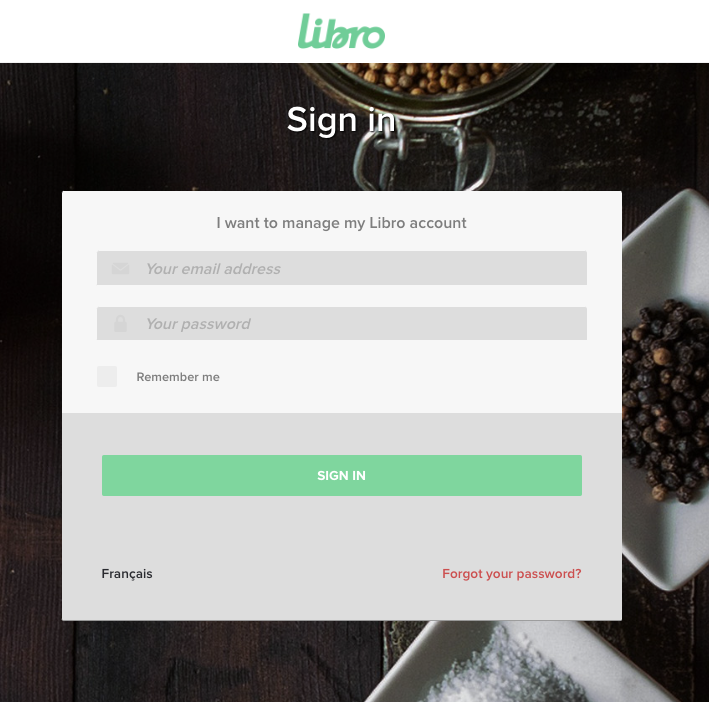

# Authentication

The Libro API uses OAuth 2.0 for authentication, providing secure access to resources while maintaining fine-grained control over permissions.

## Authentication Methods

### OAuth 2.0 Bearer Tokens


> Request:

```shell
curl https://api.libroreserve.com/oauth/token \
  -X POST \
  -d "grant_type=client_credentials&client_id=YOUR_CLIENT_ID&client_secret=YOUR_CLIENT_SECRET"
```


> Response:

```json
{
  "access_token": "eyJhbGciOiJIUzI1NiIsInR5cCI6IkpXVCJ9...",
  "token_type": "Bearer",
  "expires_in": 7200
}
```

The Libro API uses OAuth 2.0 bearer tokens for authentication. This method is secure and allows for token rotation and management.

The response will contain your access token:

## Step 1: Implement the Authorization Request

### Authorization URL

> HTML Button example

```shell
<a href="https://accounts.libroreserve.com/oauth/authorize?client_id=CLIENT_ID&redirect_uri=REDIRECT_URI&response_type=code&scope=REQUESTED_SCOPES"
  >Connect to Libro</a>
```

Create a “Connect” or “Link Account” button in your application that directs users to the Libro authorization URL. The URL should be structured as follows:

`https://accounts.libroreserve.com/oauth/authorize?client_id=CLIENT_ID&redirect_uri=REDIRECT_URI&response_type=code&scope=REQUESTED_SCOPES`


<aside class="notice">
For Staging environment use this domain name: accounts.staging.libro.app
</aside>

Replace `CLIENT_ID` with your client ID, `REDIRECT_URI` with your encoded callback URL, and `REQUESTED_SCOPES` with the permissions you need (e.g., bookings). For multiple scopes, separate each with a space (i.e., bookings people reviews).


### User Authentication and Authorization

When users click this button, they will be redirected to Libro’s system to log in (if not already logged in) and authorize your application to access their data based on the requested scopes.




## Step 2: Handle the Callback

### Receive the Authorization Code
After the user authorizes the connection, Libro’s system will redirect the user back to your application via the redirect_uri you provided during authentication, including an authorization_code as a URL parameter.

Example Callback URL:
`https://app.example.io/oauth/callback?code=AUTHORIZATION_CODE`


## Step 3: Exchange the Authorization Code for an Access Token

> Request:

```shell
curl https://accounts.libroreserve.com/oauth/token \
  -X POST \
  -d "grant_type=authorization_code&
  client_id=CLIENT_ID&
  client_secret=CLIENT_SECRET&
  code=AUTHORIZATION_CODE&
  redirect_uri=ENCODED_REDIRECT_URI"
```

> Response:

```json
{
  "access_token": "eyJhbGciOiJIUzI1NiIsInR5cCI6IkpXVCJ9...",
  "refresh_token": "eyJhbGciOiJIUzI1NiIsInR5cCI6IKSJFGDKJF...",
  "token_type": "Bearer",
  "expires_in": 7200
}
```

Libro’s system will respond with an access and refresh token that your application can use to make authenticated requests to Libro’s API on behalf of the user.

The expires_in value returned in the token response is expressed in seconds, as per the OAuth 2.0 specification.


## Step 4: Make Authenticated Requests

> Request:

```shell
curl https://accounts.libroreserve.com/restricted/restaurant/bookings/63873433 \
  -H "Content-Type: application/json" \
  -H "Authorization: Bearer ACCESS_TOKEN"
```

> Response:

```json
{
  "data": {
    "id": "63873433",
    "type": "bookings",
    "attributes": {
      "status": "confirmed",
      "date": "2023-01-01T12:00:00Z",
      "party_size": 4
      ...
    }
  }
}
```

Your application can now access Libro’s API by including the access token in the `Authorization` header of your requests


## Step 5: Handle Token Expiration

> Request:

```shell
curl https://accounts.libroreserve.com/oauth/token \
  -X POST \
  -d "grant_type=refresh_token&
  client_id=CLIENT_ID&
  client_secret=CLIENT_SECRET&
  refresh_token=REFRESH_TOKEN"
```

> Response:

```json
{
  "access_token": "eyJhbGciOiJIUzI1NiIsInR5cCI6IkpXVCJ9...",
  "refresh_token": "eyJhbGciOiJIUzI1NiIsInR5cCI6IkpXVCJ9...",
  "token_type": "Bearer",
  "expires_in": 7200
}
```

Access tokens expire after a period (typically 2 hours). Your application should handle token expiration and renewal:

1. Store the `expires_in` value when receiving a token
2. Implement a token refresh mechanism before expiration
3. If you receive a `401 Unauthorized` error, request a new token

<aside class="warning">
Never share your client secret or access tokens. Store them securely and never expose them in client-side code.
</aside>

### Token Endpoint

Make a POST request to Libro’s token endpoint with the refresh token to obtain a new access token.


## Error Handling
Ensure your application gracefully handles errors such as invalid or expired refresh tokens by prompting the user to reauthorize if necessary.

By adding these details, the guide provides a comprehensive approach to handling token refresh, ensuring continuous and secure access to Libro’s API.

